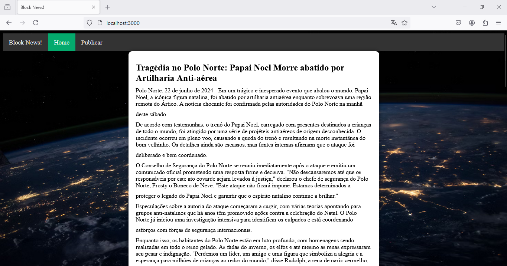
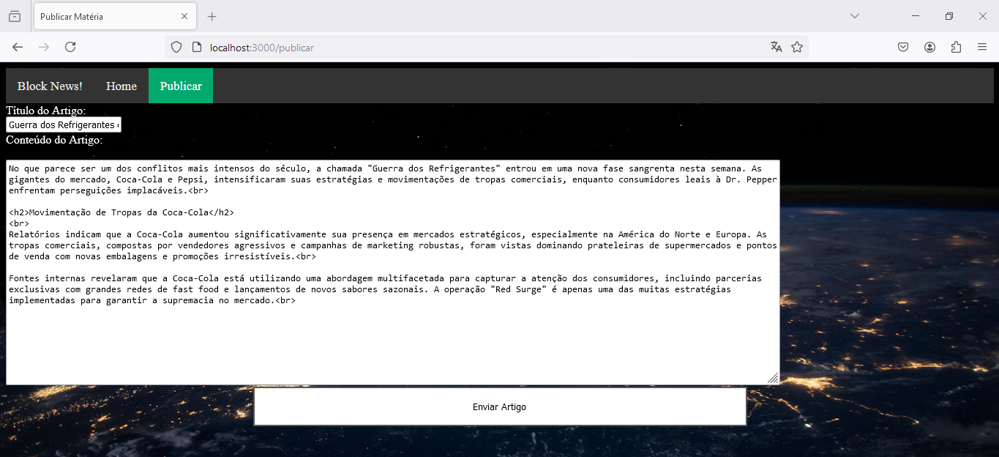

# Cliente Rede Aberta

## Visão Geral

Essa é a versão do servidor onde o usuário final possa acessar diretamente a rede, isto é, redes abertas ou situações em que o usuário tenha acesso à rede por VPN.

O backend age como um provedor de arquivos html e javascript, os quais efetivamente realizam a conexão com a rede e no caso de uma publicação, se conectam com a carteira metamask e realizam o "post" da matéria.

## Pré-requisitos

- carteira da metamask, preferencialmente com uma conta de teste
- node versão 18 ou superior
- conhecimentos básicos de hardhat e blockchain

## Inicializando a aplicação

Realize o clone do projeto e acesse o presente diretório:

```bash
> git clone https://github.com/joaopedrolourencoaffonso/blockchain-scroller.git
> cd blockchain-scroller\hardhat
```

Instale as dependências:

```bash
> npm install
```

Uma vez com as dependências instaladas, abra o arquivo `.env` no mesmo diretório e cole o seu endereço de teste na metamask.

Inicialize o nó do Hardhat:

```bash
> npx hardhat node
```

Abraoutra aba, acesse o diretório do Hardhat novamente e execute o script abaixo, ele contém comandos com alguns scripts na pasta "hardhat\scripts" os quais irão realizar o deploy do contrato, realizar alguns posts de placeholder, um post em html completo e por fim, transferir 100 ethers da conta de teste padrão `0xf39...` para a conta configurada no `.env`.

```bash
> npx hardhat run .\scripts\deploy-Scroller.js --network localhost; npx hardhat run .\scripts\gera-eventos.js --network localhost; npx hardhat run .\scripts\um-post.js --network localhost; npx hardhat run .\scripts\transfere-eth.js --network localhost;
```

Abra mais uma aba de comando, acesse o diretório `cliente_rede_aberta` e instale suas dependências:

```bash
> cd cliente_rede_aberta
> npm install
```

Por fim, inicalize o servidor:

```bash
> node .\app.js
Server listening on port 3000
```

A aplicação estará disponível em localhost:3000.



Para realizar uma publicação, basta ir em localhost:3000/publicar.



Basta clicar em "Enviar Artigo" e depois autorizar a operação com sua carteira.

Perceba que essa operação somente é autorizada pois o script [`deploy-Scroller.js`](../hardhat/scripts/deploy-Scroller.js) adiciona o endereço configurado como `MEUENDERECO` no arquivo [`.env`](../hardhat/.env) à lista de autores autorizadas logo após o deploy.